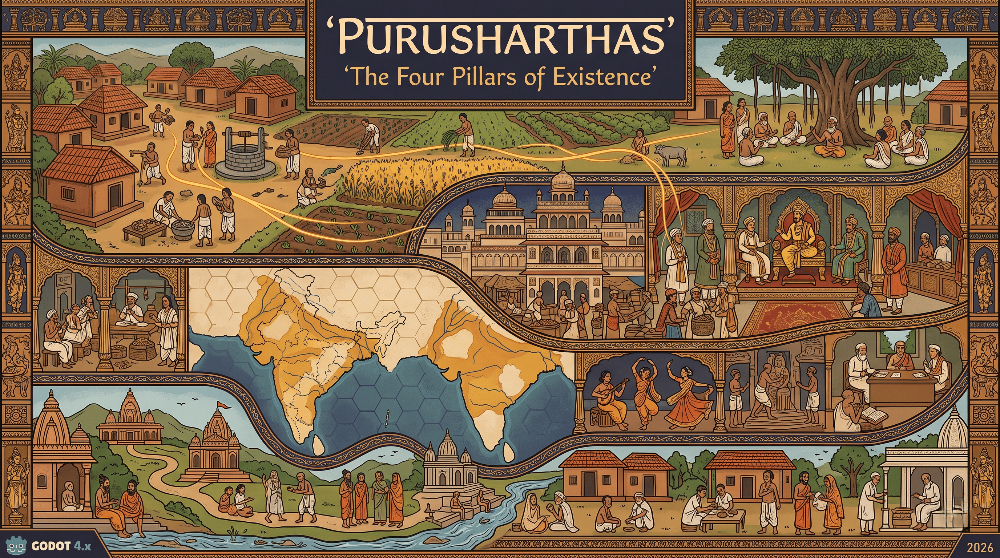

# Purusharthas: The Four Pillars of Existence



**Purusharthas** is a 2D strategy and simulation game grounded entirely in the philosophical and civilisational heritage of ancient India. The player does not control a single hero, but rather stewards an entire civilisation across four interlocked modes of existence. Progress is measured through legacy, balance, and the flourishing of people, culture, and spirit across generations.

---

## 🤖 Development Architecture: An AI-Driven Project

This game repository represents a unique paradigm in game development. **The entire codebase and game structure have been built fully by AI.**

The division of labor for this project is strictly defined as follows:

* **Human Director (Supervision):** The human creator is solely responsible for high-level oversight. This includes defining the overarching game strategy, managing the flow of the story, and ensuring the narrative architecture (such as the *Kathakaar* framing device) aligns with the civilisational realism intended for the game.
* **AI Developer (Execution):** The AI has generated 100% of the code, game logic, and system integrations. Additionally, the AI strictly handles backend performance, **resource optimization**, and **security** to ensure the four interlocked simulation layers run seamlessly without memory leaks or vulnerabilities.

---

## 📜 The Core Concept: The Purushartha Framework

The game asks a central question: *"What does it mean to live — and to govern — rightly?"* There is no single win condition and no villain. The game operates across four parallel gameplay layers that form a unified ecosystem:

* **Dharma (Village Builder):** A real-time, top-down simulation where you nurture a self-sufficient *gram* (village) through seasonal cycles and Panchayat governance.
* **Artha (Dharmic Governance):** A turn-based kingdom management layer where you act as a *Raja*, balancing four resource axes (Dharma, Artha, Kama, Moksha) alongside a council of ministers.
* **Kama (Civilisation-Lite):** A turn-based hex-tile strategy map where you guide dynasties (Maurya, Gupta, Chola, Maratha, or Vijayanagara) to build a cultural and diplomatic legacy.
* **Moksha (Pilgrim Route Sim):** A real-time logistics layer focused on sustaining a sacred corridor of *dharamshalas*, temples, and rest houses to achieve *Tirtha* status.

Every decision ripples across the timeline: a famine in your Dharma layer reduces taxes in the Artha layer, while a surge in Moksha pilgrims boosts morale across your civilisation.

---

## 🛠️ Technical Structure

The project is built on **Godot 4.x (GDScript)**. The architecture is designed to support the four interlocking layers using a shared civilisational state.

### Directory Layout

* `res://layers/` — Four subdirectories, one for each Purushartha layer, operating independently.
* `res://core/` — Contains the `GlobalState` autoload (shared civilisational state), the `EventBus` for cross-layer signal relays, and the Save System.
* `res://ui/` — Shared user interface components (resource bars, advisor panels, notification toasts).
* `res://assets/` — Art (Pattachitra, Mughal miniature, and Warli styles), audio (raga systems, folk instrumentation), and fonts.
* `res://data/` — JSON data files handling historical events, dynasties, buildings, and trade goods.

---

## 🚀 Installation & Setup

1. Download and install **Godot Engine 4.x**.
2. Clone this repository:
```bash
git clone https://github.com/yourusername/purusharthas-game.git

```


3. Open Godot, click **Import**, and navigate to the `project.godot` file inside the cloned directory.
4. Run the project by pressing `F5`.

---

## 🎵 Art & Audio Note

The aesthetic fuses Odishan Pattachitra (village layer) with Mughal miniature traditions (governance layer), unified by a color palette of deep ochre, indigo, saffron, forest green, ivory, and gold. The audio dynamically mixes Hindustani classical ragas, Carnatic elements, and folk instrumentation depending on the active gameplay layer.

*(Note: Audio and visual assets are AI-generated based on these cultural parameters).*